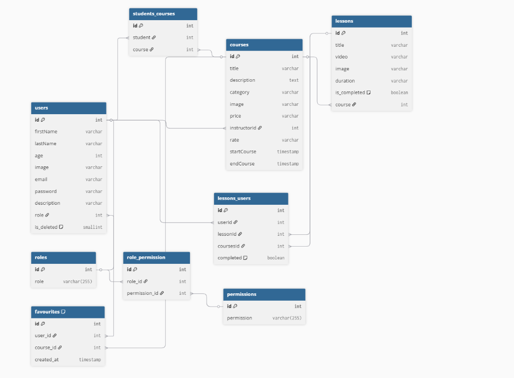

  

<h3 align="center">Teachinq Squad</h3>

  A modern full-stack E-Learning web application that connects students with
  high-quality online courses.
   
  <a href="">Live Demo</a>
   

<h2>📝 Table of Contents</h2>
<ul>
  <li><a href="#about">About</a></li>
  <li><a href="#getting_started">Getting Started</a></li>
  <li><a href="#usage">Usage</a></li>
  <li><a href="#built_using">Built Using</a></li>
  <li><a href="#user_story">User Story</a></li>
  <li><a href="#data_flow">Data Flow</a></li>
  <li><a href="#guided_by">Guided By</a></li>
</ul>

<h2 id="about">🧐 About</h2>

  The <strong>Teachinq Squad</strong> is a web-based application designed to
  provide students with easy access to online courses and learning materials,
  while allowing instructors to manage and publish educational content
  efficiently.

  The platform offers a clean and user-friendly interface where users can browse
  courses, enroll, watch lessons, and track their learning progress. It uses a
  structured SQL database to ensure reliable data storage and relationships
  between users, courses, and lessons.

<h2 id="getting_started">🏁 Getting Started</h2>

  These instructions will help you set up the project locally for development and
  testing purposes.

<h3>Prerequisites</h3>
<ul>
  <li>
    Visual Studio Code –
    <a href="https://code.visualstudio.com/">Download</a>
  </li>
  <li>
    Git Bash –
    <a href="https://git-scm.com/downloads">Download</a>
  </li>
  <li>
    Neon (PostgreSQL) –
    <a href="https://neon.tech/">Visit Neon</a>
  </li>
  <li>
    Node.js –
    <a href="https://nodejs.org/en/">Download</a>
  </li>
</ul>

<h3>Installing</h3>
<ol>
  <li>
    Clone the repository:
    <pre><code>git clone https://github.com/MERAKI-Academy-Project-5/MERAKI_Academy_Project_5</code></pre>
  </li>
  <li>
    Install dependencies in both <strong>backend</strong> and
    <strong>frontend</strong> folders:
    <pre><code>npm install</code></pre>
  </li>
  <li>
    Run the backend server:
    <pre><code>npm run dev</code></pre>
  </li>
  <li>
    Run the frontend application:
    <pre><code>npm run dev</code></pre>
  </li>
</ol>

The application is now ready to use.

<h2 id="usage">🎈 Usage</h2>
<ul>
  <li>Browse courses without registration</li>
  <li>Create an account and log in</li>
  <li>Enroll in courses and watch lessons</li>
  <li>Instructors can add and manage courses</li>
  <li>Track learning progress</li>
</ul>

<h2 id="built_using">⛏️ Built Using</h2>
<ul>
  <li>
    <a href="https://neon.tech/">Neon (PostgreSQL)</a> – SQL Database
  </li>
  <li>
    <a href="https://expressjs.com/">Express.js</a> – Backend Framework
  </li>
  <li>
    <a href="https://reactjs.org/">React.js</a> – Frontend Framework
  </li>
  <li>
    <a href="https://nodejs.org/en/">Node.js</a> – Server Environment
  </li>
  <li>
    <a href="https://jwt.io/">JWT</a> – Authentication
  </li>
</ul>

<h2 id="user_story">👤 User Story</h2>

  Project management and user stories are available on Trello:
   
  <a href="https://trello.com/b/0ZIkkEVm/merakiacademyproject5">Trello Board</a>

<h2 id="data_flow">🔄 Data Flow</h2>

  

## ⚠️ Guided By 
This project is guided by ©️ **[MERAKI Academy](https://www.meraki-academy.org)**
